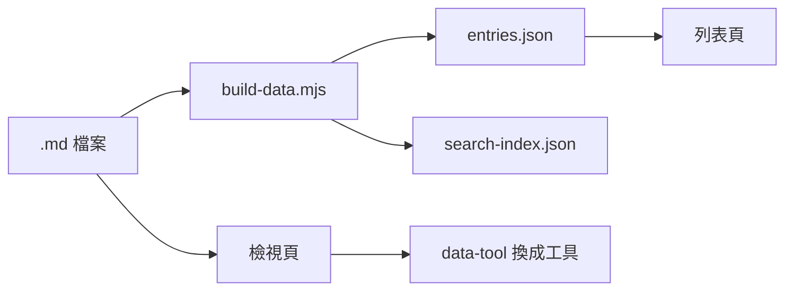

<!-- title: 內容能寫些什麼 -->
<!-- description: 這個網站支援的 Markdown 語法: 程式碼、表格、數學式、流程圖、圖片與工具佔位 -->
<!-- category: guide -->
<!-- tags: meta, writing -->
<!-- published time: 2026/08/18 -->

寫工具頁與教學頁用的是同一套 Markdown。這一頁把能用的東西列一遍，
順便當成排版的檢查表 —— 改動樣式之後，開這一頁看有沒有壞掉最快。

## 基本語法

支援 GitHub Flavored Markdown: **粗體**、*斜體*、~~刪除線~~、`行內程式碼`、
[連結](https://developer.mozilla.org)（站外連結會自動開新分頁）。

> 引言區塊。用來放重點、注意事項，或引用別人的話。
>
> 可以有很多段。

清單: 

- 項目
- 項目
  - 巢狀項目
- 項目

1. 有序清單
2. 第二項
3. 第三項

待辦: 

- [x] 已完成的項目
- [ ] 還沒做的項目

## 標題與大綱

`##` 到 `######` 的標題會自動進入右側的大綱，並自動編號。
滑鼠移到標題上會出現一顆鏈結按鈕，點下去會複製**那一節的完整網址**——
因為整個網站活在 hash 路由裡，單純的 `#id` 錨點會把路由洗掉，所以另外做了這顆按鈕。

搜尋結果也會直接連到命中的那一節。

## 程式碼

用三個反引號，後面接語言名稱: 

```python
def fib(n):
    a, b = 0, 1
    for _ in range(n):
        a, b = b, a + b
    return a
```

```java
public class Robot {
    public void periodic() {
        drivetrain.update();
    }
}
```

語法上色是 highlight.js，配色全部走主題變數。每個程式碼區塊右上角有複製鈕。

程式碼的內容也會被全文搜尋索引到 —— 有時候你只記得某個指令長什麼樣子，
記不得是在哪一頁看到的。

## 表格

```md
| 欄位 | 說明 |
| --- | --- |
| id | 唯一識別 |
```

| 欄位 | 型別 | 說明 |
| --- | --- | --- |
| `id` | string | 唯一識別，從檔名產生 |
| `type` | string | `tool` 或 `doc` |
| `tags` | string[] | 定義在 `data/site.json` |

表格太寬時外框會自己出現橫向捲軸，不會把整頁撐爆。

## 數學式

用 KaTeX 渲染。行內用單個 `$`: 質量與能量的關係是 $E = mc^2$。

獨立成行用兩個 `$$`: 

$$
\sigma(x) = \frac{1}{1 + e^{-x}}
$$

$$
\sum_{i=1}^{n} i = \frac{n(n+1)}{2}
$$

## 流程圖

程式碼區塊的語言寫 `mermaid`: 



主題顏色已經對過，深色底上看得清楚。

## 圖片

```md

```

圖片放在 `assets/images/content/`，建議每一頁一個資料夾。
相對路徑會自動補上這個前綴，所以只要寫 `資料夾/檔名`。

方括號裡填簡短說明 —— 滑鼠移到圖片上會浮出來，點圖片可以放大看。

## 工具佔位

這是這個網站和一般部落格唯一的差別: 

```md
<div data-tool="text-stats"></div>
```

渲染完之後會被換成真的工具。放在內文任何位置都可以，一頁放好幾個也行。
例如這裡就再放一次字數統計: 

<div data-tool="text-stats"></div>

詳細的做法在[怎麼加一個新工具](#/entry?id=add-a-tool&from=doc)。

## 原生 HTML

Markdown 裡可以直接寫 HTML，工具佔位就是靠這個。
但除非必要，還是用 Markdown —— HTML 寫多了，之後要改樣式會很痛苦。

---

分隔線用三個減號。以上就是全部。
